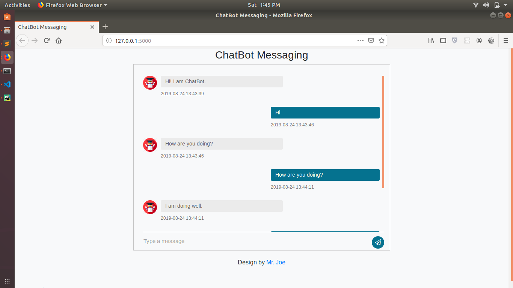

# python-chatbot-app-example

Python chatbot based on chatterBot is a machine-learning based conversational dialog engine build in
Python which makes it possible to generate responses based on collections of
known conversations. The language independent design of Python chatbot allows it
to be trained to speak any language.

An example of typical input would be something like this:

> **user:** Good morning! How are you doing?  
> **bot:**  I am doing very well, thank you for asking.  
> **user:** You're welcome.  
> **bot:** Do you like hats?  

### Install project dependencies
`$pip install -r requirements.txt`

### Run the app:
`$python app.py`

